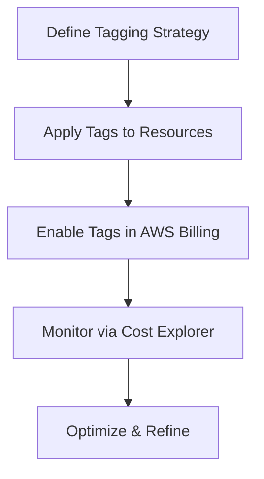

# AWS Cost Allocation Tags - Documentation

| Created | Last Updated | Version | Author | Comment | Reviewer |
| ------- | ------------ | ------- | ------ | ------- | -------- |
| 12-05-25 | 12-05-25 | V1 | Aniruddh Dangarh | Internal Reviewer | Komal Jaiswal |
| 12-05-25 | 12-05-25 | V1 | Aniruddh Dangarh | L0 Reviewer | Gaurav Singla |
| 12-05-25 | 12-05-25 | V1 | Aniruddh Dangarh | L1 Review   | Rahul Gupta    |
| 12-05-25 | 12-05-25 | V1 | Aniruddh Dangarh | L2 Review   | Mahesh Kumar    |

## Table of Contents
1. [Introduction](#1-introduction)  
2. [What are AWS Cost Allocation Tags?](#2-what-are-aws-cost-allocation-tags)  
3. [Why Use AWS Cost Allocation Tags?](#3-why-use-aws-cost-allocation-tags)  
4. [Workflow Diagram](#4-workflow-diagram)  
5. [Advantages](#5-advantages)  
6. [Best Practices](#6-best-practices)  
7. [Conclusion](#7-conclusion)  
8. [Contact Information](#8-contact-information)  
9. [References](#9-references)  

---

## 1. Introduction  
Amazon Web Services (AWS) provides a robust cloud infrastructure, but managing costs efficiently is crucial for businesses. AWS Cost Allocation Tags help organizations track, categorize, and allocate cloud expenses accurately. By tagging AWS resources, businesses gain granular visibility into spending, optimize budgets, and improve financial accountability.

---

## 2. What are AWS Cost Allocation Tags?  
AWS Cost Allocation Tags are metadata labels (key-value pairs) assigned to AWS resources (e.g., EC2, S3, RDS) to organize and track costs.  

### Types of Tags:  
- **AWS-Generated Tags**: Automatically applied by AWS (e.g., `aws:createdBy`).  
- **User-Defined Tags**: Custom tags created by users (e.g., `Department: Finance`).  

### Example Tags:  
- `Environment: Production`  
- `Project: Alpha`  
- `CostCenter: Marketing`  

---

## 3. Why Use AWS Cost Allocation Tags?  
- **Cost Visibility**: Break down costs by department/project.  
- **Budgeting & Forecasting**: Allocate cloud expenses accurately.  
- **Chargeback/Showback**: Bill internal teams based on usage.  
- **Optimization**: Identify underutilized resources.  
- **Compliance**: Enforce tagging policies for governance.  

---

## 4. Workflow Diagram  

## 5. Advantages
- Granular Cost Tracking
- Automated Reporting (via AWS Cost & Usage Reports)
- Policy Enforcement (SCPs, AWS Config)
- Cost Accountability (Owner tags)
- Better Decision-Making

## 6. Best Practices
- Standardize Naming: Use consistent casing (e.g., Team:DevOps).
- Automate Tagging: Use AWS Lambda or Systems Manager.
- Mandate Critical Tags: Enforce Owner, Environment, Project.
- Monitor Compliance: AWS Config rules for untagged resources.
- Combine with Budgets: Set cost alerts by tag.

## 7. Conclusion
Implementing AWS Cost Allocation Tags enhances cost transparency, optimizes spending, and ensures compliance. Follow best practices for long-term cloud financial management.

## 8. Contact Information

| Name            | Email Address                                             |
|------------------|-----------------------------------------------------------|
| Aniruddh Dangarh | [aniruddh.dangarh.snaatak@mygurukulam.co](mailto:aniruddh.dangarh.snaatak@mygurukulam.co) |

## 9. References

| Links                                                                                      | Descriptions                                            |
|---------------------------------------------------------------------------------------------|--------------------------------------------------------|
| https://docs.aws.amazon.com/awsaccountbilling/latest/aboutv2/cost-alloc-tags.html  | AWS Cost Allocation Docs                |
| https://docs.aws.amazon.com/whitepapers/latest/tagging-best-practices/tagging-best-practices.html | AWS Tagging Best Practices       |
